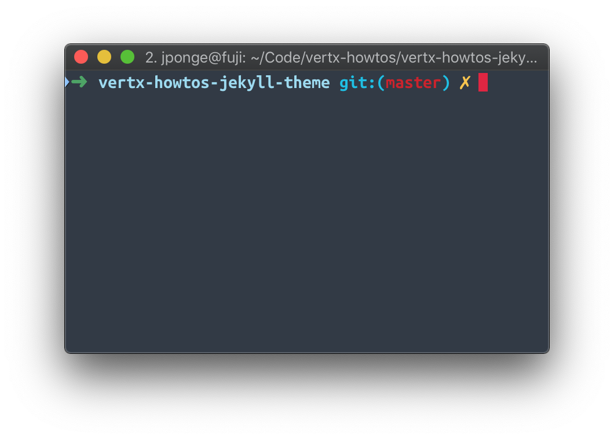

= This is a test
:page-github: foo/bar
:page-layout: page

This is a test to develop the theme.

== A first section

https://vertx.io[Vert.x, when simplicity meets simplicity.]

Here is a list:

- foo
- bar
- baz

Not bad, not bad...

== Now, some code

Here is a _classic_ hello world in Java:

[source,java]
.Hello.java
----
public class Hello {
    public static void main(String[] args) {
        System.out.println("Hello!");   // <1>
    }
} // <2>
----
<1> Prints `Hello!`.
<2> Well... nothing.

[TIP]
This is a tip, somehow very useful.

== Last but not least

Here is a picture:

[WARNING]
====
Do not do this at home.
====
